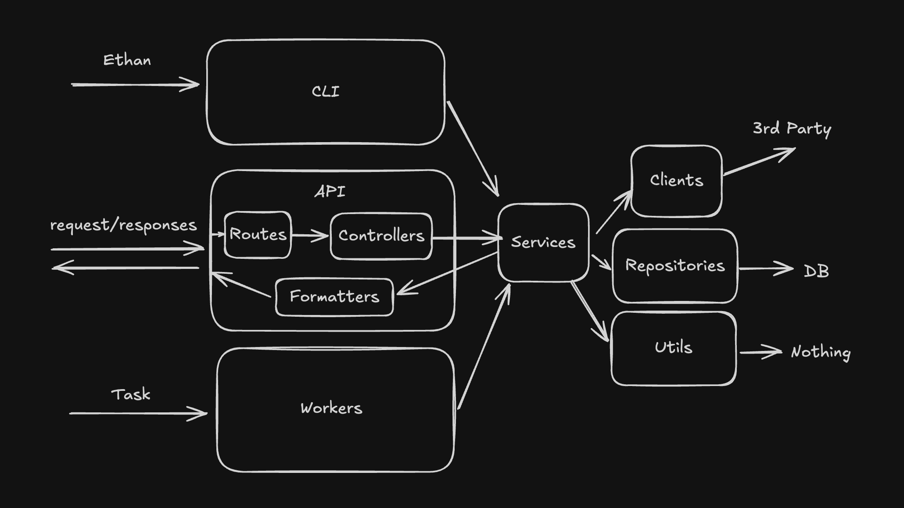

# Express Nextjs Monorepo Template

## Overview
Got annoyed rebuilding the same project every time I wanted to start something new so I put all the reusable pieces into one template and made it open source for everyone to use.

## What it comes with
- express backend (with lots of useful features)
- next js frontend
- shared folder for types & utilities
- nx for faster builds
- eslint & prettier

## Express Backend
### Structure

Going back to front lets start with the clients, repositories & utils. I like to think about these as
1. clients - anything from backend to 3rd party
2. repositories - anything from backend to database
3. utils - anything from backend to ... nothing

Then Services bring these together to perform business logic. Services shouldn't have to think about the data being in the right structure to be handled. That is the responsibility of the starting layer: CLI, API or Queues

1. CLI - this layer should be setup so that it can call services in a one off style
2. API - this layer handles taking in request, converting them to the format that the services require through a controller and returning a response in the proper format using a formatter.
3. Queues - this is the same idea but flow starts from a job

From my experience this structure scales pretty well and keeps things pretty organized 

### Stack
- `typescript` & `express` ... obvs
- ORM `prisma-kysely` - I switched from `prisma` to `kysely` because I found for more complicated queries prisma just didn't hold up plus I find it kinda stupid that as a developer I needed to think in sql, convert my thoughts to prisma language just for prisma to convert back to sql. `Kysely` is a typesafe sql query builder so pretty sick, only issue is I found migrations required a lot of boiletplate and I missed how simple things were with `prisma`. Then I found `prisma-kysely` literally the best of both worlds. Write you migrations with prisma but generate the output as kysely
- `Bullmq` for jobs
- `passport.js` for authentication
- `Zod` for request/response validation

### Features
The backend comes with a lot of features I typically needed to copy paste from other projects
- example endpoints to get started
- config setup
- database setup
- queue setup
- redis setup
- logging
- sentry
- caching
- rate limiting
- request validation
- basic authentication
- error handling

Additionally, the backend is setup with a shared types folder so it's easy to setup with a frontend.

# Next.js Frontend
- Kinda got lazy and didn't do much for this part. Just ask chatGPT bruh

